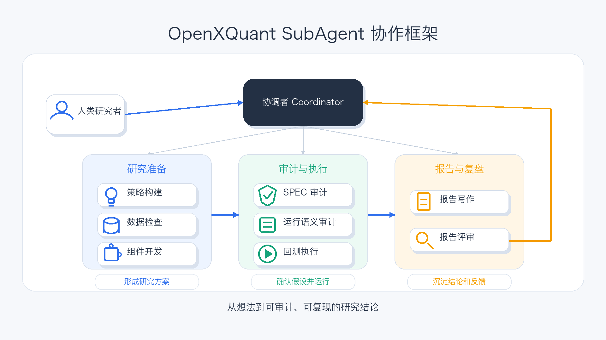

# Human Guide - 安装 open-xquant Agent 能力

这份文档给真实用户看，只说明如何把 open-xquant 交给任意 Agent 完成安装。
具体安装命令、profile 选择、目标目录和校验步骤由 `docs/agent-guide.md`
提供给 Agent 执行。



## 1. Clone 代码

```bash
git clone https://github.com/xingwudao/open-xquant
cd open-xquant
```

确认当前目录是 open-xquant 根目录：

```bash
test -f pyproject.toml && test -d src/oxq && test -d agent/skills
```

## 2. 在 open-xquant 根目录启动任意 Agent

命令行方式可以在当前目录启动你常用的 Agent，例如：

```bash
codex
claude
opencode
```

如果你使用 GUI Agent，例如 Cursor、Claude Code 或其他桌面客户端，打开这个
`open-xquant` 文件夹作为当前项目即可。

open-xquant 不是为某一个 Agent 定制的项目。只要你的 Agent 能读取当前仓库、
执行 shell 命令，并按 `docs/agent-guide.md` 操作，就可以完成安装。

## 3. 让 Agent 按 agent-guide 安装

在 Agent 中输入：

```text
请阅读 docs/agent-guide.md。
按照里面的步骤安装 open-xquant 的长期 Agent 能力。
安装后运行 uv run oxq agent status，并告诉我安装结果。
```

Agent 会根据 `docs/agent-guide.md`：

- 检查本机 Python、`uv` 和 open-xquant 仓库环境。
- 询问或选择合适的 Agent profile。
- 把 skills 和角色安装到对应 Agent 的长期能力目录。
- 写入 `~/.config/open-xquant/agent.yaml` 和安装元数据。
- 运行 `uv run oxq agent status` 确认安装状态。

安装完成后，你就可以在其他研究目录里直接向已安装的 Agent 描述策略想法。
后续使用方式由已安装的 `open-xquant` skill 路由，不需要再重复阅读本文件。
